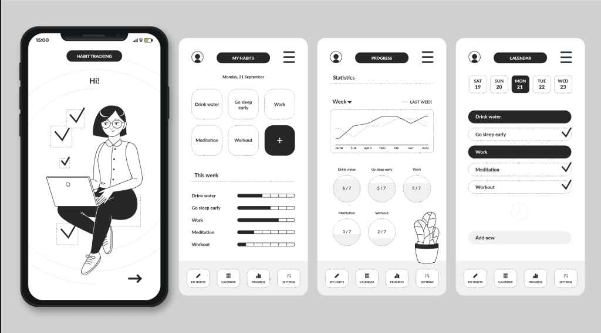

# HabitFlow - A Modern Habit Tracking PWA

HabitFlow is a clean, modern, and intuitive Progressive Web App (PWA) designed to help you build, track, and maintain healthy habits. With its gamified approach and detailed progress visualization, HabitFlow motivates you to stay consistent and achieve your goals.



## Features

-   **Intuitive Habit Management**: Easily add, complete, and delete your daily habits.
-   **Dashboard Overview**: Get a quick glance at your habits for the day and your weekly progress.
-   **Calendar View**: Track your habit history and manage completions for any given day.
-   **Detailed Progress Tracking**:
    -   Visualize your weekly completion rate with a line chart.
    -   See your current streak for each habit.
-   **Gamification System**:
    -   **Points & Levels**: Earn points for completing habits and level up.
    -   **Achievements**: Unlock badges for reaching milestones (e.g., creating 5 habits, maintaining a 7-day streak).
-   **Personalization**:
    -   **Light & Dark Mode**: Switch between themes for your comfort.
    -   **Accent Colors**: Customize the app's look and feel by choosing your favorite color.
-   **Progressive Web App (PWA)**:
    -   **Installable**: Add HabitFlow to your home screen for an app-like experience.
    -   **Offline First**: Use the app even without an internet connection, thanks to Service Workers caching assets.
-   **Responsive Design**: A seamless experience across mobile and desktop devices.

## Tech Stack

-   **Frontend**: HTML5, CSS3, JavaScript (ES6 Modules)
-   **Libraries**:
    -   [Day.js](https://day.js.org/): For easy date and time manipulation.
    -   [Chart.js](https://www.chartjs.org/): For creating beautiful and responsive charts.
-   **PWA Technologies**:
    -   [Service Workers](https://developer.mozilla.org/en-US/docs/Web/API/Service_Worker_API): For offline functionality and asset caching.
    -   [Web App Manifest](https://developer.mozilla.org/en-US/docs/Web/Manifest): To make the app installable.

## Getting Started

To run this project on your local machine, you'll need a local server. This is because Service Workers, a core PWA technology, require a secure context (HTTPS or `localhost`).

### Prerequisites

-   A modern web browser (like Chrome, Firefox, or Edge).
-   A local web server. If you have Node.js installed, you can use `live-server`. Otherwise, Python's built-in server is a great option.

### Installation & Setup

1.  **Clone the repository:**
    ```sh
    git clone <your-repository-url>
    cd <repository-directory>
    ```

2.  **Run a local server:**

    **Option A: Using `live-server` (Node.js)**
    If you don't have `live-server` installed, run:
    ```sh
    npm install -g live-server
    ```
    Then, start the server in the project directory:
    ```sh
    live-server
    ```

    **Option B: Using Python's HTTP Server**
    If you have Python 3 installed, run:
    ```sh
    python -m http.server
    ```
    For Python 2, use:
    ```sh
    python -m SimpleHTTPServer
    ```

3.  **Open the app:**
    Open your web browser and navigate to the address provided by your local server (e.g., `http://localhost:8080` or `http://127.0.0.1:5500`).

## Project Structure

The project is organized into modular JavaScript files to ensure maintainability and separation of concerns.